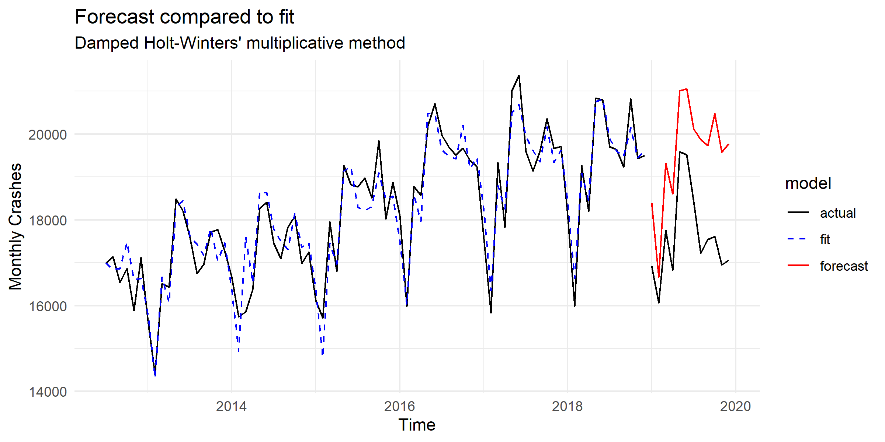

# nyc-car-crashes
Time series analysis of car crashes in nyc

I used ETS and Arima methods to predict 2019 monthly car crashes in NYC. The best fit is shown in the plot below. 

Clearly, the 2019 values took an unexpected dip, which would have been difficult to capture in a model. Nonetheless, the forecast still looks strong and captured the summer & autumn spikes. 